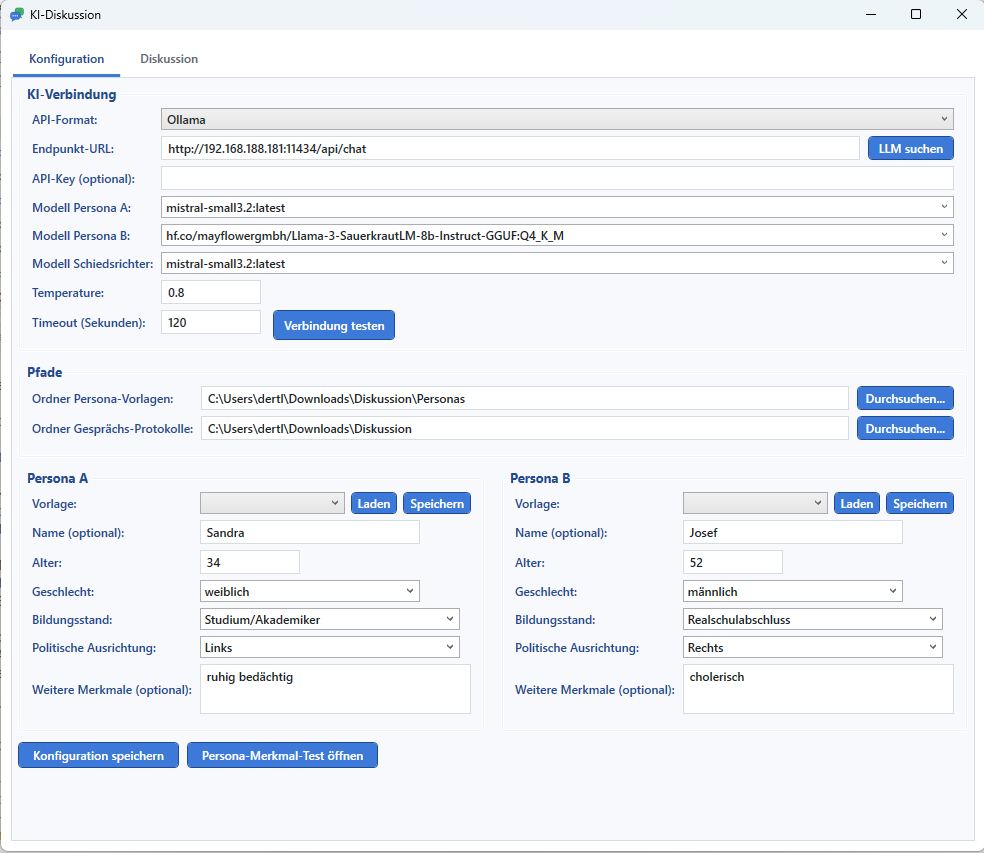
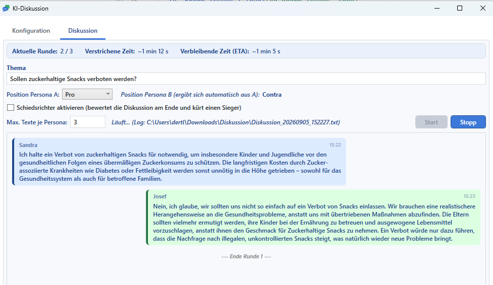

# KI-Diskussion

A Windows desktop app that pits two independent AI personas against each other in a structured debate over a topic you choose - each persona only knows its own profile, the opponent's profile, and the transcript so far. An optional third AI acts as referee, reads the whole debate once it's over, and declares (and justifies) a winner.

The AI connection is fully configurable: point it at a local [Ollama](https://ollama.com) instance, a remote one, or any OpenAI-compatible chat-completion endpoint.

**GitHub:** [github.com/thunder312/Discussion](https://github.com/thunder312/Discussion)




## Table of contents

- [A. User guide](#a-user-guide)
- [B. Technical overview](#b-technical-overview)
- [C. Testing tool: PersonaTraitTest](#c-testing-tool-personatraittest)
- [D. Known issues / ToDo](#d-known-issues--todo)
- [Installation](#installation)

## A. User guide

### What it does

1. **Configure two personas** on the *Configuration* tab: age, gender, education level, political leaning, an optional free-text trait, and an optional display name (falls back to "Persona A" / "Persona B" if left empty). Personas can be saved as reusable templates and loaded into either slot later.
2. **Pick a topic and a stance** on the *Discussion* tab, e.g. *"Sollen zuckerhaltige Snacks verboten werden?"* ("Should sugary snacks be banned?"). Persona A's stance (Pro/Contra) is chosen explicitly; Persona B always takes the opposite stance automatically - a debate needs an opposing point.
3. **Press Start.** Persona A opens with a thesis, Persona B rebuts it, and so on, alternating for the configured number of rounds. Each persona is a fully separate conversation with its own system prompt and message history - it does not know it's talking to another AI, and it never sees more about its opponent than the opponent's profile.
4. **Optional referee.** If enabled, a third AI - primed as an expert on the discussion's topic - reads the full transcript after the last round and responds with `Gewinner: <name>` followed by a reasoned justification (which arguments were strongest/weakest on each side).
5. Everything appears live in a chat-style view (round separators, a colored referee verdict) and is written to a timestamped log file that starts with a full settings header (topic, stances, both persona profiles, models used, referee configuration) so a past run can always be reconstructed later.

### Example

Topic: *"Sollen zuckerhaltige Snacks verboten werden?"*

| | Persona A | Persona B |
|---|---|---|
| Name | Sandra | Josef |
| Age | 34 | 52 |
| Education | Studium/Akademiker (university) | Realschulabschluss (secondary school) |
| Political leaning | Links (left) | Rechts (right) |
| Stance | Pro | Contra *(automatic)* |

Sandra opens arguing that sugary snacks should be banned for public-health reasons; Josef counters that personal responsibility and education are the better lever, not bans. After 3 rounds each, the referee reads the whole exchange and picks a winner with a justification referencing the specific arguments made.

### Getting started

1. Install the app (see [Installation](#installation)) or run it from source: `dotnet run --project Discussion`.
2. On the **Configuration** tab:
   - Set the **Endpoint URL** (e.g. a local Ollama instance: `http://localhost:11434/api/chat`) and the **API format** (Ollama or OpenAI-compatible).
   - Click **Search models (LLM suchen)** to populate the model dropdowns for Persona A, Persona B and the Referee - each can use a different model, or the same one.
   - Fill in Persona A and B (or load a saved template), optionally set custom folders for persona templates / logs, and click **Save configuration**.
3. On the **Discussion** tab: enter the topic, pick Persona A's stance, the number of statements per persona, and whether the referee should run.
4. Click **Start**; **Stop** ends the run early. Progress (current round, elapsed time, a live ETA) is shown at the top.

Since a fresh install ships with no AI endpoint configured, the first thing to do is set one up in the Configuration tab.

## B. Technical overview

### Tech stack

- **.NET 8**, C# 12
- **WPF** (Windows Presentation Foundation) with a hand-rolled MVVM setup (no external MVVM framework/package)
- **System.Text.Json** for settings and persona-template persistence
- Plain `HttpClient` talking directly to an Ollama-style (`/api/chat`) or OpenAI-compatible (`/v1/chat/completions`) endpoint - no AI SDK dependency
- **WiX Toolset v5** for the MSI installer
- No third-party NuGet packages

### Project layout

```
Discussion/
├── Models/          Plain data classes: AppSettings, KiVerbindung (connection), PersonaProfil,
│                     Pfade (configurable folders), ChatEintrag, and enums (ApiFormat, Sprecher, Position)
├── Services/
│   ├── KiClient.cs             HTTP calls to the AI endpoint (chat + model listing)
│   ├── DiskussionsEngine.cs    Runs the round loop and the referee call, builds system prompts
│   ├── DiskussionsLogger.cs    Writes the timestamped log file incl. settings header
│   ├── ConfigService.cs        Loads/saves AppSettings as JSON (%AppData%\Discussion\config.json)
│   └── PersonaVorlagenService.cs   Save/list/load reusable persona templates as JSON files
├── ViewModels/
│   ├── MainViewModel.cs   All UI state and commands (INotifyPropertyChanged, hand-rolled RelayCommand)
│   └── RelayCommand.cs
├── Converters/      WPF IValueConverter/IMultiValueConverter/DataTemplateSelector implementations
│                     (chat-bubble alignment/color, round-separator template)
├── MainWindow.xaml(.cs)   Single window, two tabs: Configuration and Discussion
└── App.xaml(.cs)
Tools/
└── PersonaTraitTest/   Standalone WPF tool to measure how persona traits affect answers - see section C
installer/
├── Product.wxs      WiX v5 source for the MSI installer
└── publish/         dotnet publish output (not committed; see Installation)
docs/screenshots/    Screenshots used in this README
```

### How a discussion runs

- Persona A and Persona B are two **completely separate** conversations: each has its own system prompt (own profile + the *opponent's* profile + the fixed Pro/Contra stance) and its own growing message history. Neither persona is told it might be talking to an AI.
- Because the full message history is resent on every call, each persona effectively "remembers" the entire debate and is instructed not to repeat arguments or contradict itself.
- After the configured number of rounds, if the referee is enabled, a **third, independent** call is made with a system prompt framing the referee as a topic expert, followed by the concatenated transcript, asking for a winner and a justification.
- A chat-log entry with `Sprecher = Trenner` (round separator) is inserted after every round and again right before the referee call, both in the UI and the log file.

### AI connection

- Two request/response shapes are supported, selected via **API-Format**:
  - **Ollama**: `POST {url}/api/chat`, `{"model", "messages", "stream": false, "options": {"temperature"}}`, response read from `message.content`.
  - **OpenAI-compatible**: `POST {url}/v1/chat/completions`, optional `Authorization: Bearer <key>`, response read from `choices[0].message.content`.
- **Model discovery** ("Search models" button, also run automatically on startup if an endpoint is already configured) calls `GET {origin}/api/tags` (Ollama) or `GET {origin}/v1/models` (OpenAI-compatible) and fills the model dropdowns for all three roles.
- Persona A/B round calls use the configured per-call timeout (`TimeoutSekunden`, default 300s) via a linked `CancellationTokenSource` (`KiClient.SendeAsync`).
- The **referee call has no overall time limit** - it has to process the full transcript and can genuinely take much longer than a single round on a busy/slow endpoint. Instead, `KiClient.SendeLangeAsync` streams the response (`stream: true`) and uses an **idle watchdog**: it only aborts if no new data arrives for 120s in a row, resetting on every received chunk. That way it keeps running as long as the model is actually producing output, and only gives up if the connection genuinely stalls.

## C. Testing tool: PersonaTraitTest

`Tools/PersonaTraitTest` is a small, standalone WPF tool (separate `.exe`, independent of the main app window) that measures whether - and how - the persona profile fields actually influence a model's answer. It reuses the main app's configured AI connection (`%AppData%\Discussion\config.json`) and Persona A's model.

- **Run it**: `dotnet run --project Tools/PersonaTraitTest` (or launch the built `PersonaTraitTest.exe` directly).
- **GUI**: an editable grid (min / normal / max per trait - Alter, Geschlecht, Bildungsstand, Politische Ausrichtung, Weitere Merkmale) plus an editable test question, a Start/Stop button, and a live log of every answer as it comes in.
- **Method**: for each trait, it runs 3 calls - *normal* (every trait at its normal value), *min* (only this trait at its minimum, everything else normal), *max* (only this trait at its maximum) - always resetting to the full-normal baseline before moving to the next trait, and asking a single freestanding persona (no opponent, no forced stance) the same question each time.
- **Output**: a timestamped JSON file under `Tools/PersonaTraitTest/Ergebnisse/` with every profile/answer/timing combination.

An example run and full write-up (methodology, all 15 answers, an assessment of which traits measurably affect tone/content, and suggested per-trait "influence weight" ranges) is in [`Tools/PersonaTraitTest/Ergebnisse/Persona-Merkmal-Test-Report.pdf`](../Tools/PersonaTraitTest/Ergebnisse/Persona-Merkmal-Test-Report.pdf).

## D. Known issues / ToDo

- Persona templates can be saved and loaded, but not deleted from the UI (the JSON files can be removed manually from the configured/standard folder).
- Some local models leave a stray stop-token fragment (e.g. `|im_end|>`) in their response text, which is passed through as-is.

## Installation

### Option A: MSI installer

Download `KI-Diskussion-Setup.msi` (or build it yourself, see below) and run it. It installs **per-user** (no admin rights required) to `%LocalAppData%\Programs\KI-Diskussion`, bundles both `Discussion.exe` and `Tools/PersonaTraitTest`'s `PersonaTraitTest.exe`, and adds a Start Menu shortcut for each. A fresh install has **no AI endpoint configured** - set one up on the Configuration tab before starting a discussion.

### Option B: Build the installer yourself

Requires the WiX v5 CLI (`dotnet tool install --global wix`):

```powershell
dotnet publish Discussion/Discussion.csproj -c Release -r win-x64 --self-contained true `
    -p:PublishSingleFile=true -p:IncludeNativeLibrariesForSelfExtract=true -o installer/publish

dotnet publish Tools/PersonaTraitTest/PersonaTraitTest.csproj -c Release -r win-x64 --self-contained true `
    -p:PublishSingleFile=true -p:IncludeNativeLibrariesForSelfExtract=true -o installer/publish

wix build installer/Product.wxs -arch x64 -o installer/KI-Diskussion-Setup.msi
```

### Option C: Run from source

```powershell
dotnet run --project Discussion
```

### Requirements

- Windows 10/11 (x64)
- An Ollama instance (local or remote) or any OpenAI-compatible chat-completion endpoint reachable from the machine running the app
